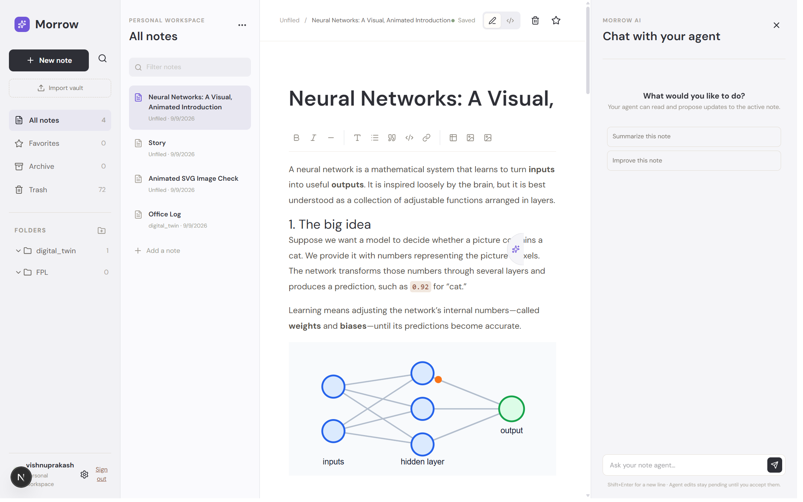

# Morrow

Morrow is a focused Markdown notes workspace for writing, organizing, and refining private notes. It combines a Milkdown editor with Supabase-backed accounts and storage, automatic saving, portable Markdown files, and an optional note-aware AI agent.

## Preview

The workspace keeps folders, note navigation, editing, and AI assistance close at hand on desktop while staying usable on smaller screens.

<p align="center">
	
</p>

## What is included

- Email/password authentication with protected workspaces and password recovery
- Folder-based note organization with drag-and-drop movement
- CommonMark/GFM editing, raw Markdown view, autosave, and recovery copies
- Favorites, archive, trash, restore, and permanent deletion workflows
- Import for Markdown vaults, including referenced images
- Single-note `.md` export and complete workspace ZIP export
- Private image attachments served through authenticated note routes
- Optional AI editing and a sidebar agent that can read the active note and propose changes
- Light and dark appearance settings

## Stack

- Next.js App Router and React
- TypeScript, Tailwind CSS, and Lucide icons
- Milkdown, CommonMark/GFM, and ProseMirror
- Supabase Auth, PostgreSQL, Storage, and Row Level Security
- Vercel AI SDK with an OpenAI-compatible OpenRouter endpoint
- Vitest, Testing Library, ESLint, and TypeScript

## Getting started

### 1. Create Supabase resources

Create a Supabase project and enable email/password authentication. Apply the migrations in `supabase/migrations` in filename order using the Supabase SQL editor or Supabase CLI:

1. `20260825000000_initial_schema.sql`
2. `20260825010000_attachments.sql`
3. `20260825020000_agent.sql`
4. `20260826000000_note_favorites.sql`
5. `20260827000000_note_archive.sql`
6. `20260828000000_note_trash.sql`

The migrations create the user-owned schema, attachment support, AI credential storage, and note lifecycle fields. Row Level Security keeps workspace data isolated per account.

### 2. Configure the environment

Copy the example file and fill in your Supabase project values:

```bash
cp .env.example .env.local
```

Required values:

```dotenv
NEXT_PUBLIC_SUPABASE_URL=https://your-project.supabase.co
NEXT_PUBLIC_SUPABASE_ANON_KEY=your-anon-or-publishable-key
```

The publishable/anon key is intended for browser use. Never put a Supabase service-role key in `.env.local` or expose one to the client.

To enable the AI routes, also set these server-side values:

```dotenv
OPENROUTER_API_KEY=your-openrouter-key
AI_ENCRYPTION_KEY=your-32-byte-encryption-key
```

The OpenRouter key is used only by the server. Users do not enter provider keys in the browser. `AI_ENCRYPTION_KEY` protects stored AI credentials when that feature is enabled.

### 3. Configure Auth redirects

In Supabase Auth settings, add this redirect URL:

```text
http://localhost:3000/auth/update-password
```

### 4. Install and run

```bash
pnpm install
pnpm dev
```

Open `http://localhost:3000` and create an account.

## Development commands

```bash
pnpm dev         # Start the Next.js development server
pnpm lint        # Run ESLint
pnpm typecheck   # Check TypeScript without emitting files
pnpm test        # Run the Vitest suite once
pnpm test:watch  # Run Vitest in watch mode
pnpm build       # Create a production build
pnpm start       # Serve the production build
```

Database TypeScript types live in `src/lib/supabase/database.types.ts`.

## Security notes

Morrow is designed around private, user-owned workspaces. Keep service-role and provider secrets on the server, preserve the supplied Row Level Security policies, and review any new database access against the authenticated user boundary. Attachments are stored under the owning user ID and served through authenticated, note-scoped routes.
